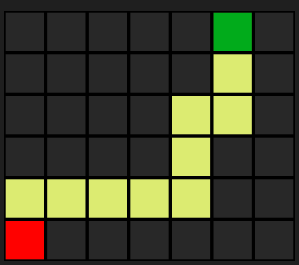

# AI Topics - Search

This project is part of the AI Topics series.

It implements uninformed searches algorithms using stack or queue data structure to solve mazes.

## Run the application:

bash

    go run main.go

Usage

    -m: Specify the maze filename (default is maze1.txt).
    -f: Choose the frontier option (stack or queue, default is queue).
    -s: Display the solution path in the image (default is true).
    -e: Display the explored path in the image (default is false).

## Results

The program will output the cost path and generate an image of the maze with the path highlighted.

The image will be saved as {maze filename}-{frontier}.png in the current directory.

### Image example:

